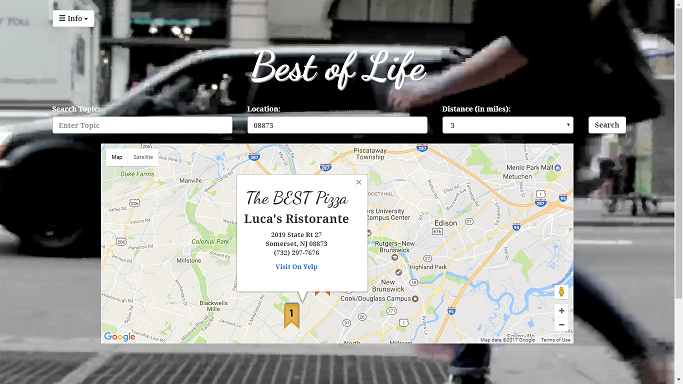

# Best of Life

The "Best of Life" is a tool anyone can use to find the "Best of" a search topic within a radius of a given location.

## Screenshots

## Technologies used
You can give a brief listing of the technologies you've learned and applied here

- google fonts 
- trello 
- coverr 
- slack 
- github 
- heroku 
- powerpoint 
- Yelp Fusion API 
- Google Maps API

## Getting Started

- Visit deployed site at https://calm-stream-84659.herokuapp.com/#

- If you want to see out code clone this repo at https://github.com/ajzamojski/Project-1.

### Prerequisities

Internet connection, web browser.

## Built With

* Sublime Text
* HTML 
* CSS 
* jQuery 
* ajax 
* javascript 
* php 
* bootstrap 

## Walk throughs of code
For Project presentation, you can include snippets of code you found buggy, interesting, or are overall proud of here.  Try to limit the quantity and size to quick readable bits.

You can also show where you've used technologies you've learned and applied here.

/*Yelp search query is sorted by 'rating' in which "The rating sort is not strictly sorted by 
the rating value, but by an adjusted rating value that takes into account the number of 
ratings, similar to a bayesian average. This is so a business with 1 rating of 5 stars 
doesn’t immediately jump to the top.". 
*/
function queryYelp(searchTerm, location, radius)
{					
	const YELP_HEROKU_ENDPOINT = "https://floating-fortress-53764.herokuapp.com/"

	var queryURL = YELP_HEROKU_ENDPOINT + "?term=" + searchTerm.replace(/\s/g, "+") +
				   "&location="+ location.replace(/\s/g, "+") + "&radius="+ radius;

	$.ajax({
	      url: queryURL,
	      method: "GET"
    }).done(function(response) {

    	//Array of all businesess from Yelp query
    	var yelpBusinesses = JSON.parse(response).businesses;

    	//Array of businesess within correct radius
    	var yelpResults = [];	

    	//If yelp returns no results, notify user via modal
    	if (yelpBusinesses[0] === undefined)
    	{	    		
    		$("#span-searchTerm").html(searchTerm);  
    		$("#span-location").html(location);
    		$("#noResults").modal();
  
    		return;
    	}
	
		//Gets only businesses within radius.
    	yelpBusinesses.forEach(function(element)
    	{
    		if (element.distance <= radius)
    		{
    			yelpResults.push(element);
    		}	
    	});

    	addMarkers(yelpResults, searchTerm);

    }).error (function()
    {
		$("#span-query").html("Yelp");
        $("#query-failed").modal();;
	});

}//END queryYelp()

## Authors
Contributors:

Doug Aquilino, Ibad Aslam, Bobby Frazette, Kevin Smart-Abbey, & Adam Zamojski

## License

This project is licensed under the MIT License - see the [LICENSE.md](LICENSE.md) file for details

